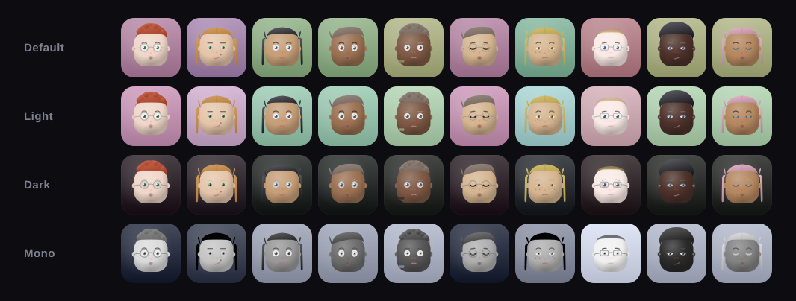

# SolFaces

[](https://www.npmjs.com/package/solfaces)
[](https://www.npmjs.com/package/solfaces)
[](https://github.com/jorger3301/SolFaces/blob/main/LICENSE)
[](https://bundlephobia.com/package/solfaces)

**Deterministic wallet avatars for the Solana ecosystem.**

Every Solana wallet address generates a unique, consistent face — no API calls, no storage, no randomness. Same wallet = same face, everywhere, forever.

Built for dApps, AI agents, social features, leaderboards, and anywhere a wallet needs a visual identity.



*Default, Light, Dark, and Mono — four of the 11 built-in themes. Each row shows the same 10 wallets rendered in a different theme.*

---

## Why SolFaces?

- **Deterministic** — Same wallet always produces the same avatar. No database needed.
- **Zero dependencies** — Core engine has no runtime dependencies.
- **~2.56B unique faces** — 11 traits with expanded ranges = massive combination space.
- **Gradient-rich rendering** — Skin-luminance-driven colors, specular highlights, cheek blush, gradient hair, glow overlays.
- **Works everywhere** — React, vanilla JS, Node, Python, CDN script tag, edge functions.
- **Pixel art mode** — Retro pixelated rendering with optional scanlines (React).
- **Liquid glass mode** — Backdrop-blur glass effect with rim lighting (React).
- **Flat mode** — Disable all gradients for simplified rendering.
- **Detail levels** — Full detail (gradients, specular, cheeks) at size >= 48, simplified below.
- **Fully customizable** — Every visual element is customizable: 4 color palettes, 8 individual color overrides, 9 per-instance color keys, rendering toggles, layout controls, blink timing, and 30+ React-only pixel/glass fields. No visual element is locked — if you can see it, you can theme it.
- **Eliminates dead space** — No more blank avatars or generic placeholders. Every wallet gets a unique face instantly.
- **AI-agent ready** — Natural language self-descriptions for agent system prompts.
- **PNG rasterization** — Serve real image files for bots, Discord, Telegram, OG images.
- **SSR-ready** — String renderer works server-side with zero browser APIs.

---

## Install

### npm / yarn / pnpm

```bash
npm install solfaces
```

### CDN (no build step)

```html
<script src="https://unpkg.com/solfaces/dist/solfaces.cdn.global.js"></script>
```

### Python

```bash
# Zero dependencies — just copy the file
curl -O https://raw.githubusercontent.com/jorger3301/solfaces/main/python/solfaces.py
```

---

## Quick Start

### React

```tsx
import { SolFace } from "solfaces/react";

function UserProfile({ walletAddress }) {
  return <SolFace walletAddress={walletAddress} size={48} enableBlink />;
}
```

### Pixel Art Mode (React)

```tsx
import { SolFace } from "solfaces/react";
import { pixelTheme, pixelRetroTheme } from "solfaces/themes";

<SolFace walletAddress="7xKXqR..." size={64} theme={pixelTheme} />
<SolFace walletAddress="7xKXqR..." size={64} theme={pixelRetroTheme} />
```

### Liquid Glass Mode (React)

```tsx
import { SolFace } from "solfaces/react";
import { glassTheme, glassDarkTheme } from "solfaces/themes";

<SolFace walletAddress="7xKXqR..." size={64} theme={glassTheme} />
```

### Vanilla JS (npm)

```js
import { mountSolFace } from "solfaces/vanilla";

mountSolFace("#avatar", "7xKXqR...", { size: 48 });
```

### CDN / Script Tag (zero build step)

```html
<div data-solface="7xKXqR..." data-solface-size="48" data-solface-theme="dark"></div>
<div data-solface="DRpbCBMx..." data-solface-flat="true"></div>
<div data-solface="9WzDXwBb..." data-solface-detail="full"></div>

<script src="https://unpkg.com/solfaces/dist/solfaces.cdn.global.js"></script>
<!-- Auto-initializes on DOMContentLoaded -->

<!-- Or use programmatically: -->
<script>
  SolFaces.mount("#my-avatar", "7xKXqR...", { size: 64 });
  const description = SolFaces.describe("7xKXqR...");
</script>
```

### Node / SSR / Edge

```ts
import { renderSolFaceSVG } from "solfaces";

const svg = renderSolFaceSVG("7xKXqR...", { size: 128 });
// Raw SVG string — use in emails, OG images, PDFs, etc.
```

### Python

```python
from solfaces import generate_traits, render_svg, describe_appearance

traits = generate_traits("7xKXqR...")
svg = render_svg("7xKXqR...", size=256)
desc = describe_appearance("7xKXqR...")
```

---

## Rendering Modes

### Full Detail vs Simplified

SolFaces automatically adjusts detail based on size:

- **Full detail** (size >= 48): Gradient fills, specular highlights on eyes, cheek blush, chin shadow, face glow, eyelid strokes, jawline hints.
- **Simplified** (size < 48): Flat shapes optimized for small sizes — no gradients, no cheeks, no specular.

Override with the `detail` option:

```ts
renderSolFaceSVG("7xKXqR...", { detail: "full" });    // Force full detail at any size
renderSolFaceSVG("7xKXqR...", { detail: "simplified" }); // Force simplified
renderSolFaceSVG("7xKXqR...", { detail: "auto" });     // Default — based on size
```

### Flat Mode

Disable all gradients globally. Useful for print, email clients, or minimal UIs:

```ts
import { flatTheme } from "solfaces/themes";

renderSolFaceSVG("7xKXqR...", { theme: flatTheme });
// Zero <linearGradient> or <radialGradient> elements in output
```

Or set `flat: true` on any theme:

```ts
renderSolFaceSVG("7xKXqR...", { theme: { flat: true } });
```

### Pixel Art Mode (React Only)

Renders the SVG at a low pixel density then scales up with `image-rendering: pixelated`:

```tsx
import { pixelTheme, pixelRetroTheme, pixelCleanTheme } from "solfaces/themes";

<SolFace walletAddress="7xKXqR..." theme={pixelTheme} />       // 16px density, rounded
<SolFace walletAddress="7xKXqR..." theme={pixelRetroTheme} />  // 12px + scanlines + shadow
<SolFace walletAddress="7xKXqR..." theme={pixelCleanTheme} />  // 24px, clean
```

### Liquid Glass Mode (React Only)

Backdrop-blur glass effect with specular highlights and rim lighting:

```tsx
import { glassTheme, glassDarkTheme } from "solfaces/themes";

<SolFace walletAddress="7xKXqR..." theme={glassTheme} />
<SolFace walletAddress="7xKXqR..." theme={glassDarkTheme} />
```

---

## AI Agent Identity

SolFaces gives AI agents a visual identity tied to their wallet. The `describeAppearance()` function generates natural language descriptions agents can use in system prompts to know and reference what they look like.

### System Prompt Integration

```ts
import { agentAppearancePrompt } from "solfaces";

const appearance = agentAppearancePrompt("7xKXqR...", "Atlas");
// → "My visual identity is a SolFace avatar (ID: a3f2b1c0) derived from
//    my wallet address. I'm Atlas. I have a squircle face with warm golden skin,
//    almond-shaped hazel eyes with gently curved eyebrows, and flowing
//    auburn wavy hair. I'm wearing aviator sunglasses. I have a playful grin.
//    This appearance is deterministic — anyone who looks up my wallet will
//    see the same face."

const systemPrompt = `You are Atlas, a DeFi trading agent. ${appearance}`;
```

### Description Formats

```ts
import { describeAppearance } from "solfaces";

// Full paragraph (for bios, about pages)
describeAppearance("7xKXqR...", { format: "paragraph", perspective: "third" });

// First person (for agent self-reference)
describeAppearance("7xKXqR...", { format: "paragraph", perspective: "first", name: "Atlas" });

// Structured (for data display)
describeAppearance("7xKXqR...", { format: "structured" });
// → "Face: squircle\nSkin: warm golden\nEyes: almond-shaped, hazel\n..."

// Compact (for alt text, captions)
describeAppearance("7xKXqR...", { format: "compact" });
// → "squircle face, warm golden skin, hazel almond eyes, wavy auburn hair, aviator sunglasses, grinning"
```

### Alt Text & Accessibility

```ts
import { solFaceAltText } from "solfaces";

const alt = solFaceAltText("7xKXqR...");
// → "SolFace avatar: squircle face, warm golden skin, hazel almond eyes, ..."
```

### Python (AI Agent Backends)

```python
from solfaces import agent_appearance_prompt

prompt = agent_appearance_prompt("7xKXqR...", "Atlas")
# Identical output to the JavaScript version
```

---

## PNG Rasterization

For Discord bots, Telegram bots, OG images, emails, and anywhere SVG isn't supported.

### Node.js

Requires `sharp` or `@resvg/resvg-js` (install one):

```bash
npm install sharp
# or
npm install @resvg/resvg-js
```

```ts
import { renderSolFacePNG } from "solfaces";

const pngBuffer = await renderSolFacePNG("7xKXqR...", { pngSize: 512 });

// Save to file
import fs from "fs";
fs.writeFileSync("avatar.png", pngBuffer);

// Send as HTTP response
return new Response(pngBuffer, {
  headers: { "Content-Type": "image/png" },
});
```

### Browser

```ts
import { renderSolFacePNGBrowser, renderSolFacePNGDataURL } from "solfaces";

// As Blob (for downloads, uploads)
const blob = await renderSolFacePNGBrowser("7xKXqR...", { pngSize: 256 });

// As data URL (for img.src)
const dataUrl = await renderSolFacePNGDataURL("7xKXqR...", { pngSize: 256 });
```

---

## Themes

SolFaces ships with 11 preset themes. Themes control colors, gradients, borders, rendering modes, and more.

### Available Presets

| Theme | Description | Works In |
|-------|-------------|----------|
| `default` | Base look with gradient-rich rendering — no overrides | All renderers |
| `dark` | Dark backgrounds with muted tones and subtle border | All renderers |
| `light` | Soft pastel backgrounds with rounded corners | All renderers |
| `mono` | Full grayscale — all colors replaced with grays | All renderers |
| `flat` | Disables all gradients — flat fill colors only | All renderers |
| `transparent` | Transparent background with flat rendering | All renderers |
| `glass` | Liquid glass effect with backdrop blur and specular highlights | React only |
| `glassDark` | Dark variant of liquid glass with deeper blur | React only |
| `pixel` | Pixel art mode at 16px density with rounded corners | React only |
| `pixelRetro` | Retro pixel art with scanlines and drop shadow | React only |
| `pixelClean` | Clean pixel art at 24px density | React only |

### Using Themes

```ts
import { renderSolFaceSVG } from "solfaces";
import { darkTheme } from "solfaces/themes";

const svg = renderSolFaceSVG("7xKXqR...", { theme: darkTheme });
```

### Custom Themes

Every visual element is customizable through the theme system — color palettes, individual colors, rendering toggles, layout, and more. All fields are optional; only override what you need.

```ts
import type { SolFaceTheme } from "solfaces";

const myTheme: SolFaceTheme = {
  // Color palettes (arrays — one color per trait variant)
  skinColors: ["#fce4d4", "#f5d0b0", "#e8b88a", "#d4956a", "#b5724a", "#8d5524", "#6b3f1d", "#4a2c17", "#3a1f10", "#2a1008"],
  eyeColors: ["#333", "#4a80c4", "#5a9a5a", "#c89430", "#8a8a8a"],
  hairColors: ["#1a1a1a", "#4a3728", "#8b6b4a", "#c44a20", "#d4a844", "#6090e0", "#14F195", "#e040c0", "#ff6b6b", "#4ecdc4"],
  bgColors: ["#14F195", "#4a90e2", "#9945FF", "#f0e68c", "#e06070", "#ff8c42", "#5bc0be", "#8338ec", "#ff006e", "#3a86ff"],

  // Individual color overrides
  mouthColor: "#e06070",
  eyebrowColor: "#aaa",
  accessoryColor: "#888",         // Default glasses/earring/headband color
  eyeWhiteColor: "#e0e0e0",      // Sclera + teeth color (important for dark themes)
  noseColor: "#c68642aa",         // Nose color (defaults to skin-derived)
  glassesColor: "#333",           // Glasses frame color (overrides accessoryColor)
  earringColor: "#ffd700",        // Earring color (overrides accessoryColor)
  headbandColor: "#e04080",       // Headband color (overrides accessoryColor)

  // Rendering control
  flat: false,                    // Set true to disable all gradients
  cheekEnabled: true,             // Enable/disable cheek blush
  cheekColor: "#ff8080",          // Custom cheek color
  cheekOpacity: 0.3,              // Cheek blush opacity
  skinOpacity: 1,                 // Skin fill opacity
  shadowEnabled: true,            // Enable/disable chin shadow
  glowIntensity: 0.15,           // Face glow strength

  // Layout
  bgOpacity: 1,
  bgRadius: 14,
  border: { color: "#14F195", width: 2 },
};
```

### Extending Presets

```ts
import { getPresetTheme } from "solfaces/themes";

const myTheme = getPresetTheme("dark", {
  bgRadius: 999,
  border: { color: "#14F195", width: 1 },
  eyeWhiteColor: "#d0c8c0",  // Warmer eye whites for dark mode
});
```

### Theme Field Reference

**Color palettes** (arrays — one per trait variant):

| Field | Type | What it controls |
|-------|------|-----------------|
| `skinColors` | `string[]` | 10 skin tone colors |
| `eyeColors` | `string[]` | 5 iris/pupil colors |
| `hairColors` | `string[]` | 10 hair fill colors |
| `bgColors` | `string[]` | 10 background fill colors |

**Individual color overrides:**

| Field | Type | What it controls |
|-------|------|-----------------|
| `mouthColor` | `string` | Mouth stroke/fill |
| `eyebrowColor` | `string` | Eyebrow stroke |
| `accessoryColor` | `string` | Default accessory color (glasses, earring, headband) |
| `eyeWhiteColor` | `string` | Sclera (eye white) and teeth color — set for dark themes |
| `noseColor` | `string` | Nose color (defaults to skin-derived + transparency) |
| `glassesColor` | `string` | Glasses frame color (overrides accessoryColor) |
| `earringColor` | `string` | Earring color (overrides accessoryColor) |
| `headbandColor` | `string` | Headband color (overrides accessoryColor) |

**Rendering control:**

| Field | Type | What it controls |
|-------|------|-----------------|
| `flat` | `boolean` | Disable all gradients (flat fill colors only) |
| `cheekEnabled` | `boolean` | Enable/disable cheek blush |
| `cheekColor` | `string` | Custom cheek color |
| `cheekOpacity` | `number` | Cheek blush opacity (0-1) |
| `skinOpacity` | `number` | Skin fill opacity (0-1) |
| `shadowEnabled` | `boolean` | Enable/disable chin shadow and face overlays |

**Layout:**

| Field | Type | What it controls |
|-------|------|-----------------|
| `bgOpacity` | `number` | Background opacity (0-1) |
| `bgRadius` | `number` | SVG rect border radius (999 = circle) |
| `border` | `{ color, width }` | Optional border around avatar |

### Pixel Art Customization (React Only)

All `_pixel*` fields are React-only. Set `_pixel: true` to enable pixel art mode.

| Field | Type | Default | What it controls |
|-------|------|---------|-----------------|
| `_pixel` | `boolean` | `false` | Enable pixel art mode |
| `_pixelDensity` | `number` | `16` | Render resolution before upscale (lower = blockier) |
| `_pixelRounded` | `boolean` | `true` | Rounded corners on pixel container |
| `_pixelOutline` | `boolean` | `false` | Draw outline around pixel art |
| `_pixelOutlineColor` | `string` | `"#000"` | Outline color |
| `_pixelOutlineWidth` | `number` | `1` | Outline width in pixels |
| `_pixelContrast` | `number` | — | CSS contrast filter |
| `_pixelSaturation` | `number` | — | CSS saturation filter |
| `_pixelBrightness` | `number` | — | CSS brightness filter |
| `_pixelScanlines` | `boolean` | `false` | Horizontal scanline overlay |
| `_pixelScanlineOpacity` | `number` | `0.08` | Scanline opacity |
| `_pixelScanlineSpacing` | `number` | `2` | Scanline spacing in pixels |
| `_pixelGrid` | `boolean` | `false` | Pixel grid overlay |
| `_pixelGridOpacity` | `number` | — | Grid opacity |
| `_pixelGridColor` | `string` | — | Grid color |
| `_pixelShadow` | `boolean` | `false` | Drop shadow behind pixel art |
| `_pixelShadowColor` | `string` | `"rgba(0,0,0,0.3)"` | Shadow color |
| `_pixelShadowOffset` | `number` | `2` | Shadow offset in pixels |

### Liquid Glass Customization (React Only)

All glass fields are React-only. Set `_glass: true` to enable liquid glass mode.

| Field | Type | Default | What it controls |
|-------|------|---------|-----------------|
| `_glass` | `boolean` | `false` | Enable liquid glass mode |
| `_blurRadius` | `number` | `12` | Backdrop blur radius |
| `_saturate` | `number` | `1.8` | Backdrop saturation multiplier |
| `_tintColor` | `string` | `"rgba(255,255,255,1)"` | Glass tint color |
| `_tintOpacity` | `number` | `0.12` | Glass tint opacity |
| `_borderColor` | `string` | `"rgba(255,255,255,0.25)"` | Glass border color |
| `_borderWidth` | `number` | `1` | Glass border width |
| `_borderOpacity` | `number` | `0.25` | Glass border opacity |
| `_specularColor` | `string` | `"rgba(255,255,255,1)"` | Specular highlight color |
| `_specularOpacity` | `number` | `0.25` | Specular highlight strength |
| `_specularEnd` | `number` | `50` | Specular gradient end (%) |
| `_lightAngle` | `number` | `135` | Light source angle (degrees) |
| `_rimIntensity` | `number` | `0.08` | Rim lighting intensity |
| `_shadow` | `string` | `"0 8px 32px rgba(0,0,0,0.12)"` | CSS box-shadow |

---

## AI Agent Tools

SolFaces ships with structured tool definitions that let AI agents discover and use it as a skill — compatible with OpenAI function calling, Anthropic tool use, Vercel AI SDK, and MCP.

### Quick Setup

```ts
import { allToolsOpenAI, handleToolCall } from "solfaces/agent";

// Register tools with your AI framework
const tools = allToolsOpenAI();  // or allToolsAnthropic(), allToolsVercelAI()

// Handle tool calls
const result = await handleToolCall("generate_solface_svg", {
  wallet: "7xKXqR...",
  theme: "dark",
  size: 128,
});
```

### Available Tools

| Tool | Description |
|------|-------------|
| `generate_solface_svg` | Render SVG avatar from wallet address |
| `describe_solface` | Natural language description of an avatar |
| `get_solface_traits` | Raw trait data with labels and hash |
| `get_agent_identity` | System prompt snippet for AI agent identity |
| `list_solface_themes` | List available preset themes |

### MCP Server (Claude Code / Cursor)

```json
{
  "mcpServers": {
    "solfaces": {
      "command": "npx",
      "args": ["-y", "solfaces"]
    }
  }
}
```

### Framework Adapters

```ts
import {
  allToolsOpenAI,      // OpenAI function calling
  allToolsAnthropic,   // Claude / Anthropic tool use
  allToolsVercelAI,    // Vercel AI SDK
  allToolsMCP,         // Model Context Protocol
  handleToolCall,      // Universal dispatcher
} from "solfaces/agent";
```

### Skill File for AI Agents

SolFaces includes a comprehensive `skill.md` that teaches AI agents how to integrate, customize, and use SolFaces. Feed it to any agent (Claude, GPT, custom bots) as context.

---

## REST API Templates

Copy-paste route handlers for serving SolFaces as an image API. Full code in `src/api-templates.ts`.

### Endpoints Pattern

```
GET /api/solface/:wallet              → SVG image
GET /api/solface/:wallet?format=png   → PNG image
GET /api/solface/:wallet?format=json  → Traits + description JSON
```

Templates included for: **Next.js App Router**, **Express**, **Hono (Cloudflare Workers / Bun)**, **Telegram Bot (grammy)**, **Discord Bot (discord.js)**.

---

## Python Port

Full Python implementation with identical trait generation to JavaScript. Zero dependencies. Includes gradient-rich rendering matching the TypeScript renderer.

```python
from solfaces import generate_traits, render_svg, describe_appearance

traits = generate_traits("7xKXqR...")
svg = render_svg("7xKXqR...", size=256)
desc = describe_appearance("7xKXqR...")
prompt = agent_appearance_prompt("7xKXqR...", "Atlas")
```

### CLI

```bash
python solfaces.py 7xKXqR...                    # Print traits
python solfaces.py 7xKXqR... --svg              # Output SVG
python solfaces.py 7xKXqR... --json             # Output JSON
python solfaces.py 7xKXqR... --describe         # Natural language
python solfaces.py 7xKXqR... --svg --size 512   # Custom size
python solfaces.py 7xKXqR... --svg --flat        # Flat mode (no gradients)
```

> **Note:** Pixel art and liquid glass modes are React-only (CSS-dependent) and not available in the Python port.

---

## CDN / Script Tag

For sites without a build step — Webflow, Notion embeds, plain HTML, WordPress.

```html
<script src="https://unpkg.com/solfaces/dist/solfaces.cdn.global.js"></script>

<!-- Data attributes auto-initialize -->
<div data-solface="7xKXqR..." data-solface-size="48"></div>
<div data-solface="DRpbCBMx..." data-solface-size="48" data-solface-theme="dark"></div>
<div data-solface="9WzDXwBb..." data-solface-blink="true"></div>
<div data-solface="Abc123..." data-solface-flat="true"></div>
<div data-solface="Def456..." data-solface-detail="full"></div>

<!-- Global API available as window.SolFaces -->
<script>
  SolFaces.mount("#avatar", "7xKXqR...", { size: 64 });
  SolFaces.setImg("#pfp", "7xKXqR...");
  const svg = SolFaces.renderSVG("7xKXqR...");
  const desc = SolFaces.describe("7xKXqR...");
  const prompt = SolFaces.agentPrompt("7xKXqR...", "Atlas");
</script>
```

---

## API Reference

| Function | Returns | Description |
|----------|---------|-------------|
| `generateTraits(wallet, overrides?)` | `SolFaceTraits` | Deterministic traits from wallet |
| `getTraitLabels(traits)` | `Record<string, string>` | Human-readable trait names |
| `traitHash(wallet)` | `string` | 8-char hex hash |
| `resolveTheme(name?, themes?)` | `SolFaceTheme \| undefined` | Look up theme by name from a map |
| `mergeTheme(base, overrides)` | `SolFaceTheme` | Merge two themes |
| `effectiveAccessory(traits)` | `number` | Accessory index (earring suppressed for long/bob hair) |
| `renderSolFaceSVG(wallet, options?)` | `string` | Raw SVG markup |
| `renderSolFaceDataURI(wallet, options?)` | `string` | Data URI for `` tags |
| `renderSolFaceBase64(wallet, options?)` | `string` | Base64 data URI |
| `renderSolFacePNG(wallet, options?)` | `Promise<Buffer>` | PNG buffer (Node) |
| `renderSolFacePNGBrowser(wallet, options?)` | `Promise<Blob>` | PNG blob (browser) |
| `renderSolFacePNGDataURL(wallet, options?)` | `Promise<string>` | PNG data URL (browser) |
| `describeAppearance(wallet, options?)` | `string` | Natural language description |
| `describeTraits(traits, options?)` | `string` | Describe from pre-generated traits |
| `agentAppearancePrompt(wallet, name?)` | `string` | System prompt for AI agents |
| `solFaceAltText(wallet)` | `string` | Accessible alt text |
| `hexToRgb(hex)` | `[r, g, b]` | Parse hex color |
| `rgbToHex(r, g, b)` | `string` | Convert RGB to hex |
| `darken(hex, pct)` | `string` | Darken a color |
| `lighten(hex, pct)` | `string` | Lighten a color |
| `blend(a, b, t)` | `string` | Blend two colors |
| `luminance(hex)` | `number` | Perceived luminance (0-255) |
| `deriveSkinColors(skinHex)` | `DerivedColors` | Full skin-luminance color derivation |
| `SOLFACE_TOOLS` | `SolFaceTool[]` | All 5 agent tool definitions |
| `handleToolCall(name, params)` | `unknown` | Universal agent tool dispatcher |

### React Component Props

```tsx
<SolFace
  walletAddress="7xKXqR..."       // Required
  size={48}                         // Default: 64
  enableBlink={true}                // Default: false — or custom timing below
  theme={darkTheme}                 // Optional theme
  detail="full"                     // "full" | "simplified" | "auto"
  traitOverrides={{ hairStyle: 0 }} // Pin specific traits
  colorOverrides={{ hair: "#ff0000" }} // Override individual colors
  className="my-avatar"             // CSS class
  style={{ borderRadius: "50%" }}   // Inline styles
  onClick={handleClick}             // All standard SVG element props supported
/>

// Custom blink timing
<SolFace
  walletAddress="7xKXqR..."
  enableBlink={{ duration: 3, delay: 1 }}  // 3s cycle, 1s initial delay
/>
```

### RenderOptions

```ts
interface RenderOptions {
  size?: number;                           // Default: 64
  theme?: SolFaceTheme;                    // Theme object
  enableBlink?: boolean | {                // Blink animation (boolean or custom timing)
    duration?: number;                     //   Blink cycle duration in seconds (default: 4)
    delay?: number;                        //   Initial delay in seconds (default: 0)
  };
  detail?: "full" | "simplified" | "auto"; // Detail level (default: "auto")
  traitOverrides?: Partial<SolFaceTraits>; // Pin specific traits
  className?: string;                      // CSS class on SVG element
  colorOverrides?: {                       // Override individual colors per instance
    skin?: string;
    eyes?: string;
    hair?: string;
    bg?: string;
    mouth?: string;
    eyebrow?: string;
    accessory?: string;
    nose?: string;
    eyeWhite?: string;
  };
}
```

### Per-Instance Color Overrides

Override any color on a specific avatar without changing the global theme:

```tsx
// React
<SolFace walletAddress="7xKXqR..." colorOverrides={{ hair: "#ff0000", bg: "#000" }} />

// String renderer
renderSolFaceSVG("7xKXqR...", {
  theme: darkTheme,
  colorOverrides: { skin: "#ffd5b0", eyes: "#00ff00" },
});
```

Available keys: `skin`, `eyes`, `hair`, `bg`, `mouth`, `eyebrow`, `accessory`, `nose`, `eyeWhite`.

### Import Paths

| Path | Contents | React? |
|------|----------|--------|
| `solfaces` | Core + colors + themes + describe + rasterize + agent tools | No |
| `solfaces/core` | Engine only (traits, renderer, colors, describe) | No |
| `solfaces/react` | React component (base + pixel + glass modes) | Yes |
| `solfaces/vanilla` | DOM helpers (mount, setImg, autoInit) | No |
| `solfaces/themes` | 11 preset themes | No |
| `solfaces/agent` | AI agent tool definitions + framework adapters | No |
| `solfaces/cdn` | IIFE for `<script>` tags | No |

---

## Trait System

| Trait | Variants | Options |
|-------|----------|---------|
| Face Shape | 4 | Squircle (all — preserved for PRNG ordering) |
| Skin Color | 10 | Porcelain, Ivory, Fair, Light, Sand, Golden, Warm, Caramel, Brown, Deep |
| Eye Style | 8 | Round, Minimal, Almond, Wide, Relaxed, Joyful, Bright, Gentle |
| Eye Color | 5 | Chocolate, Sky, Emerald, Hazel, Storm |
| Eyebrows | 5 | Wispy, Straight, Natural, Arched, Angled |
| Nose | 4 | Shadow, Button, Soft, Nostrils |
| Mouth | 8 | Smile, Calm, Happy, Oh, Smirk, Grin, Flat, Pout |
| Hair Style | 10 | Bald, Short, Curly, Side Sweep, Puff, Long, Bob, Buzz, Wavy, Topknot |
| Hair Color | 10 | Black, Espresso, Walnut, Honey, Copper, Silver, Charcoal, Burgundy, Strawberry, Ginger |
| Accessory | 10 | None, Beauty Mark, Round Glasses, Rect Glasses, Earring, Headband, Freckles, Stud Earrings, Aviators, Band-Aid |
| Background | 10 | Rose, Olive, Sage, Fern, Mint, Ocean, Sky, Lavender, Orchid, Blush |

**Total unique combinations: ~2,560,000,000**

Algorithm: **djb2 hash** → **mulberry32 PRNG** → sequential trait sampling. Sub-millisecond. Deterministic across JS and Python.

### Color Derivation

v2 introduces skin-luminance-driven color derivation. Every face's shadow colors, highlights, cheek blush, lip color, nose shading, ear colors, brow colors, and eye white adaptation are automatically computed from the skin tone's luminance. This creates cohesive, natural-looking faces without manual palette tuning.

---

## Architecture

```
solfaces/
├── src/
│   ├── core/
│   │   ├── colors.ts      # Color math: darken, lighten, blend, deriveSkinColors
│   │   ├── traits.ts       # Types, palettes, theme system, trait generation
│   │   ├── renderer.ts     # SVG string renderer (gradient-rich, detail levels)
│   │   ├── describe.ts     # Natural language descriptions for AI agents
│   │   ├── rasterize.ts    # PNG output (sharp / resvg / canvas)
│   │   └── index.ts
│   ├── react/
│   │   ├── SolFace.tsx     # React component (base + pixel art + liquid glass)
│   │   └── index.ts
│   ├── vanilla/
│   │   └── index.ts        # mountSolFace, setSolFaceImg, autoInit
│   ├── themes/
│   │   ├── presets.ts      # 11 preset themes
│   │   └── index.ts
│   ├── agent/
│   │   ├── tools.ts        # 5 canonical tool definitions + handlers
│   │   ├── index.ts        # Format adapters (MCP, OpenAI, Anthropic, Vercel AI)
│   │   └── mcp-server.ts   # Standalone MCP server (npx solfaces)
│   ├── cdn.ts              # IIFE bundle for <script> tag
│   ├── api-templates.ts    # Copy-paste route handlers
│   └── index.ts
├── python/
│   └── solfaces.py         # Full Python port (zero deps, gradient rendering)
├── package.json
└── tsup.config.ts
```

### Key Design Decisions

- **`colors.ts` is the single source of truth** for all color math. Both `renderer.ts` and `SolFace.tsx` import from it, preventing renderer drift.
- **`effectiveAccessory()`** handles earring suppression: long and bob hairstyles suppress earring accessories.
- **`_` prefix** on theme fields marks React-only features (pixel, glass). The string renderer ignores these.
- **Detail levels** are resolved at render time: `"auto"` → full if size >= 48, simplified otherwise.

---

## Migration from v1

v2.0.0 is a breaking release:

- **All faces change.** Trait ranges expanded (skin 6→10, mouth 6→8, hair 8→10, accessories 6→10, bg 5→10), so every wallet generates a different face than in v1.
- **Old themes removed.** `solana`, `neon`, `jupiter`, `phantom`, `circle` themes are gone. Use `dark`, `light`, `mono`, `flat`, `transparent`, or the new `glass`/`pixel` themes.
- **New rendering engine.** Gradient-rich rendering with skin-luminance-driven colors, ears, hair-back layers, and face overlays.
- **New theme fields.** `flat`, `cheekEnabled`, `shadowEnabled`, `glowIntensity`, and React-only `_glass*`/`_pixel*` fields.
- **`colorOverrides` still supported.** Per-instance color overrides work the same as v1.

---

## License

MIT — use it anywhere, commercial or open source.

Built by [https://github.com/jorger3301](https://github.com/jorger3301)
